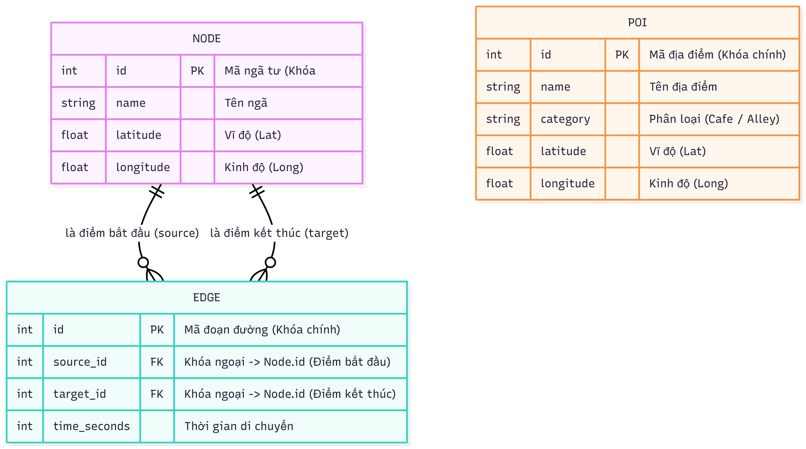

# 🗺️ AI Itinerary Planner - Hệ thống Lên kế hoạch Hành trình Thông minh

[](https://www.djangoproject.com/)
[](https://react.dev/)
[](https://www.docker.com/)
[](https://goong.io/)
[](https://openai.com/blog/clip/)

Hệ thống ứng dụng **Goong Maps SDK chính chủ** kết hợp với trí tuệ nhân tạo để tự động hóa việc lên kế hoạch hành trình du lịch dựa trên **ý định người dùng (Intent-driven)** và tối ưu hóa bằng **Giải thuật Di truyền (Genetic Algorithm)**.

---

## 📂 Cấu trúc dự án (Refined)

```text
N09_TDTT/
├── ai_engine/          # Thuật toán tối ưu & Routing core
├── backend/            # Django REST Framework (Business Logic)
│   ├── api/            # API Endpoints & Semantic Search
│   ├── data/           # Seed data (JSON vector files)
│   └── media/          # Ảnh địa điểm (Local GIS Storage)
├── frontend/           # React + Vite (UI/UX)
├── docs/               # Tài liệu dự án & Sơ đồ ERD
├── scripts/            # Công cụ hỗ trợ (Crawl ảnh, xử lý dữ liệu)
└── docker-compose.yml  # Hạ tầng PostgreSQL (pgvector)
```

---

## ⚡ Cài đặt nhanh (Quick Setup)

Dành cho các thành viên muốn khởi chạy dự án ngay lập tức. Hãy copy và dán toàn bộ các khối lệnh bên dưới vào Terminal.

### 1. Chuẩn bị Hạ tầng (Docker & Env)
*Chạy tại thư mục gốc:*
```bash
# Tạo file cấu hình từ mẫu, điền GOONG_API_KEY vào .env, rồi khởi động Docker
cp .env.example .env && docker compose up -d
```

### 2. Khởi tạo Backend (Dành cho Bash/Git Bash)
*Mở một Terminal mới và chạy:*
```bash
cd backend && \
source ./venv/Scripts/activate && \
pip install -r requirements.txt && \
python manage.py migrate && \
python manage.py import_pois --clear data/district1_full_data.json && \
python manage.py runserver
```

### 3. Khởi tạo Frontend
*Mở một Terminal khác và chạy:*
```bash
cd frontend && npm install && npm run dev
```

---

## 🛠️ Cấu hình chi tiết (Hướng dẫn từng bước)

### 🔑 Bước 1: Cấu hình API Key (Bắt buộc cho Team)
Dự án sử dụng hệ sinh thái Goong Maps. Mỗi thành viên cần thực hiện 2 bước sau để chạy được bản đồ:

1.  **Cấu hình Backend:**
    - Tại thư mục `backend/`, copy file `.env.example` thành `.env`.
    - Điền `GOONG_API_KEY` (Lấy tại mục **API Key** trên Goong Dashboard). Key này dùng để tính toán lộ trình và tìm kiếm.

2.  **Cấu hình Frontend:**
    - Tại thư mục `frontend/`, copy file `.env.example` thành `.env`.
    - Điền `VITE_GOONG_MAPTILES_KEY` (Lấy tại mục **MapTiles Key** trên Goong Dashboard). Key này dùng để hiển thị nền bản đồ.

*Lưu ý: Các file `.env` đã được cấu hình trong `.gitignore` để không bị đẩy lên GitHub, giúp bảo mật Key cá nhân của mỗi thành viên.*

### 🗄️ Bước 2: Cơ sở dữ liệu & AI Search
Dữ liệu địa điểm được tích hợp sẵn vector 512 chiều để thực hiện tìm kiếm ngữ nghĩa.
- **Import lệnh:** `python manage.py import_pois --clear data/district1_full_data.json`

---

## 📸 Hình ảnh & Kiến trúc

### Sơ đồ Cơ sở dữ liệu (ERD)
Hệ thống sử dụng **PostgreSQL với extension `pgvector`** để thực hiện truy vấn vector cực nhanh từ model CLIP.



---

## 💡 Lưu ý quan trọng cho Team
- **File `.env`**: Tuyệt đối không xóa trong `.gitignore`. File này chứa `GOONG_API_KEY` và cấu hình DB riêng cho từng người, không push key cá nhân lên GitHub.
- **Goong API Key**: Mỗi thành viên tự đăng ký tài khoản tại [Goong.io](https://goong.io/) và lấy **REST API Key** rồi điền vào file `.env` của mình.
- **CLIP Model**: Ở lần đầu chạy tìm kiếm, hệ thống sẽ tải model từ HuggingFace (~600MB). Hãy đảm bảo mạng ổn định.

---
*Dự án được phát triển bởi N09 - Nhóm Tư duy tính toán.*
