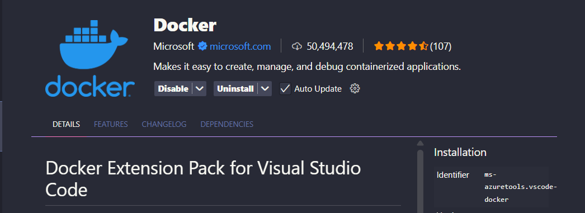
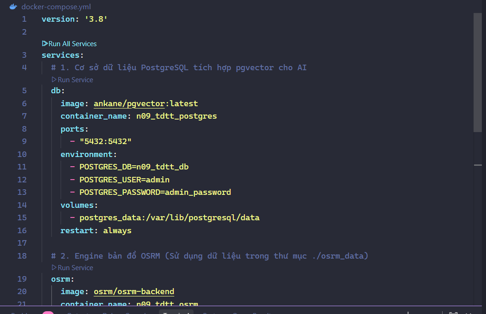

# 🗺️ Hệ thống Lên kế hoạch Hành trình Thông minh (AI Itinerary Planner)

Hệ thống ứng dụng trí tuệ nhân tạo để tự động hóa việc lên kế hoạch hành trình du lịch dựa trên **ý định người dùng (Intent-driven)**.

---

## 🚀 Tính năng nổi bật

- **Tìm kiếm Ngữ nghĩa (Semantic Search):** Sử dụng mô hình **CLIP (ViT-B-32)** để hiểu nhu cầu người dùng.
- **Tối ưu hóa hành trình:** Giải thuật **Di truyền (Genetic Algorithm)** giúp tìm lộ trình tối ưu nhất.
- **Đề xuất Đa dạng:** Cung cấp 3 phương án hành trình: *Tinh túy*, *Ẩm thực & Thư giãn*, và *Khám phá & Trải nghiệm*.
- **Định tuyến Thực tế (Local GIS):** Tích hợp engine **OSRM cục bộ** để tính toán thời gian chính xác.
- **Lưu trữ Vector:** Sử dụng mở rộng **pgvector** trên PostgreSQL để truy vấn cực nhanh.

---

## 🛠️ Công nghệ sử dụng

- **Frontend:** React.js (Vite), Leaflet Map, Lucide Icons.
- **Backend:** Django Rest Framework, PyTorch (CLIP), OSRM API.
- **Infrastructure:** Docker & Docker Compose (PostgreSQL 16 + pgvector).

---

## ⚙️ Hướng dẫn cài đặt & Khởi chạy (Dành cho Team)

Để chạy dự án này, bạn cần thực hiện theo các bước sau:

### Bước 1: Khởi tạo hạ tầng (Docker)
Đảm bảo bạn đã cài Docker Desktop, sau đó tại thư mục gốc chạy lệnh:
```bash
docker-compose up -d
```
*Lệnh này sẽ khởi động PostgreSQL (pgvector) và OSRM Engine (Cổng 5000).*

### Bước 2: Thiết lập dữ liệu nặng từ Drive
Vì các file bản đồ và dữ liệu ảnh rất nặng, bạn hãy tải từ Link Drive sau:
- **Link Drive:** [Tải tại đây](https://drive.google.com/drive/folders/1Tr-oR9hALMCJf4J4a1lRFun6iiOCzWXv?usp=drive_link)

**Hướng dẫn giải nén:**
1. File `osrm_data.zip`: Giải nén thư mục `osrm_data` bỏ vào **thư mục gốc** dự án (ngang hàng với `docker-compose.yml`).
2. File `media.zip`: Giải nén thư mục `media` bỏ vào bên trong thư mục **`backend/`**.

---

### Bước 3: Cấu hình và Chạy Backend (Django)
Mở terminal tại thư mục dự án và thực hiện:
1. Di chuyển vào thư mục backend: `cd backend`
2. Kích hoạt môi trường ảo (Windows): `venv\Scripts\activate`
3. Cài đặt thư viện: `pip install -r requirements.txt`
4. Khởi chạy server: `python manage.py runserver`

### Bước 4: Khởi động Frontend (React)
Mở một terminal khác:
1. Di chuyển vào thư mục frontend: `cd frontend`
2. Cài đặt thư viện (nếu mới tải lần đầu): `npm install`
3. Khởi chạy: `npm run dev`

---

## 📸 Hình ảnh minh họa & Giao diện

Hệ thống cung cấp giao diện trực quan với các công cụ quản lý Docker và bản đồ:

### 1. Quản lý Docker
Cài docker desktop về máy.
Bạn có thể quản lý các Service trong Docker extension hoặc qua Dashboard:


Thoát ra vào lại vscode.

*(Nhấn Run All Service để khởi động toàn bộ hệ thống)*

---

## 💡 Hướng dẫn sử dụng nhanh
1. **Vị trí bắt đầu:** Click chọn một địa điểm trên bản đồ hoặc tìm kiếm và nhấn **Chọn**.
2. **Nhập ý định:** Nhập nhu cầu của bạn (VD: "Đi ăn tối lãng mạn") vào ô kế hoạch.
3. **Gợi ý:** Nhấn nút **"Gợi ý lộ trình"** và chờ AI xử lý trong vài giây.
4. **Kết quả:** Xem 3 phương án tại tab **Kết quả** và nhấn vào từng lộ trình để xem đường đi trên bản đồ.

---

## 📝 Tài liệu bổ sung
- [Hướng dẫn Thuyết trình Kỹ thuật](./technical_presentation_guide.md)
- [Hướng dẫn Cài đặt OSRM nâng cao](./SETUP_OSRM.md)
